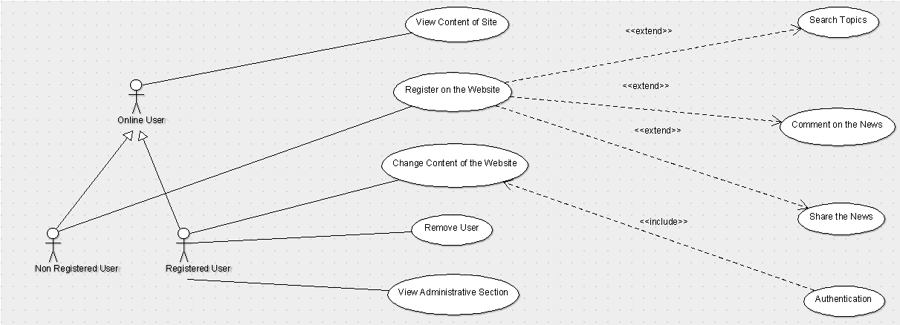

# NIIT University News Letter

The project was done as a part of Software Engineering course. This website was made to keep all the news and events taking place in NIIT University at one place. The website is completely developed in WordPress.

The team members were:

1. Ajinkya Bedekar

2. Aman Garg

3. Biren Sharma

4. Shantanu Bahuguna

5. Yogesh Sharma

The repository comprises the following:

1. Individual versions of SRS by team members

2. wp-admin folder of the project

3. UML Diagrams made with Argo UML

4. Design document of the project

5. Final project report

6. Final versions of SRS

7. Minutes of Meetings

8. Document on metrics used in the project

9. Document on novelty of the project

10. Screenshot of the UML Diagram

11. Presentations of the project

12. PDF of brief introduction to project

13. Sophistication document

14. Use case statement

Message from Dr. Anshima Prakash Srivastava:

    The sections of the Newsletter are:

    Special Events

    Campus News

    Theme (in Quarterly issues)

    Expressions

    Achievements

    Research (If Required)

    Faculty Research (If Required)

    Recruitment (If Required)

    Obituary (If Required)

    Meet the NU NL Team

The website is now launched by the NIIT University Newsletter Team.

Earlier, the team has to hard-code every time a news needs to be highlighted on the website. So, this project was done to develop a website in which a non-technical person can also upload news and events in the website just with the access to the admin panel.

Use Case Diagram:

